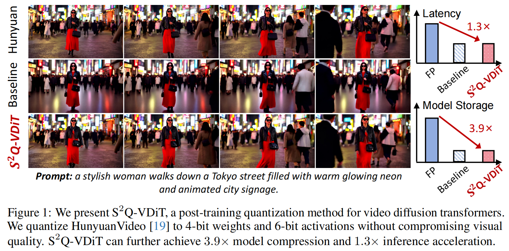
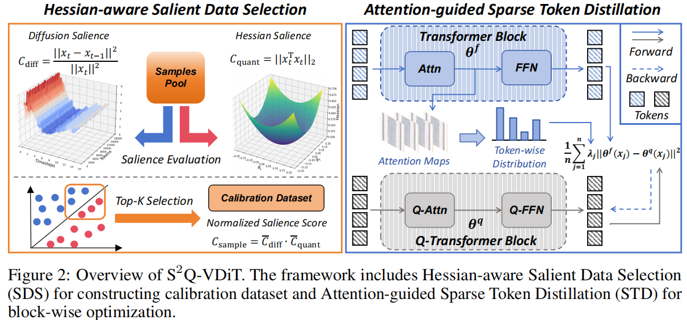
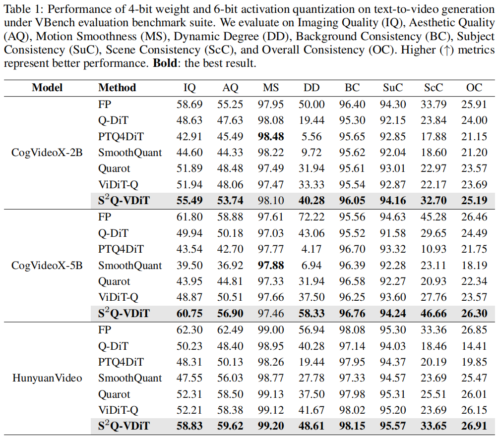

# (NeurIPS 2025) $S^2$Q-VDiT: Accurate Quantized Video Diffusion Transformer with Salient Data and Sparse Token Distillation

[arXiv](https://arxiv.org/abs/2508.04016) | [BibTeX](#bibtex)

------

This project is the official implementation of our "$S^2$Q-VDiT: Accurate Quantized Video Diffusion Transformer with Salient Data and Sparse Token Distillation".





------

## Results



## Comments

- Our code will be released soon!

## BibTeX

If you find *S^2Q-VDiT* is useful and helpful to your work, please kindly cite this paper:

```
@article{feng2025s,
  title={S $\^{} 2$ Q-VDiT: Accurate Quantized Video Diffusion Transformer with Salient Data and Sparse Token Distillation},
  author={Feng, Weilun and Qin, Haotong and Yang, Chuanguang and Li, Xiangqi and Yang, Han and Li, Yuqi and An, Zhulin and Huang, Libo and Magno, Michele and Xu, Yongjun},
  journal={arXiv preprint arXiv:2508.04016},
  year={2025}
}
```

